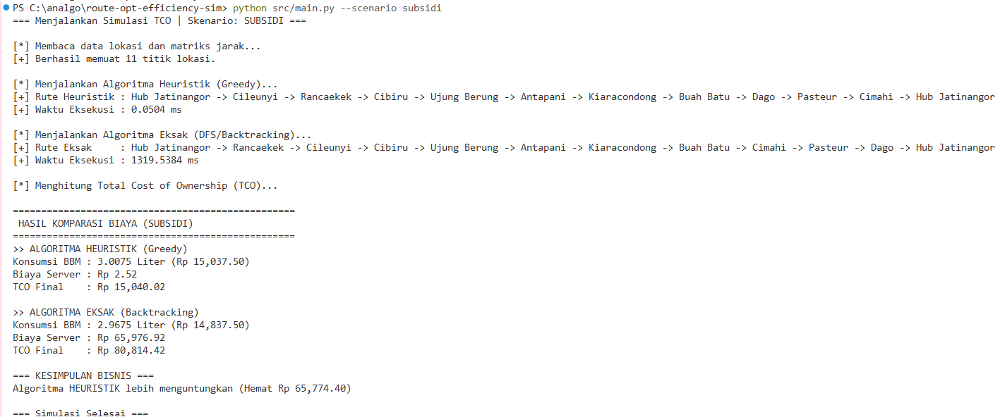
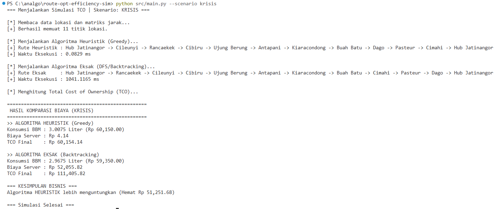

# 🚚 route-opt-efficiency-sim

[](https://www.python.org/)
[](#license)
[](#)

CLI-based simulation pipeline yang membandingkan algoritma **Exact** vs **Heuristic** untuk *Last-Mile Delivery* di bawah batasan harga bahan bakar yang dinamis, guna menganalisis **Total Cost of Ownership (TCO)**.

---

## 📑 Daftar Isi

- [Tentang Proyek](#-tentang-proyek)
- [Fitur](#-fitur)
- [Instalasi](#-instalasi)
- [Cara Penggunaan](#-cara-penggunaan)
- [Analisis Kompleksitas Algoritma A: Heuristik (Nearest Neighbor / Greedy)](#analisis-kompleksitas-algoritma-a-heuristik-nearest-neighbor--greedy)
- [Analisis Kompleksitas Algoritma B: Eksak (Backtracking / DFS dengan Pruning)](#analisis-kompleksitas-algoritma-b-eksak-backtracking--dfs-dengan-pruning)
- [Kesimpulan Bisnis & Analisis TCO](#-kesimpulan-bisnis--analisis-tco)
- [Visualisasi Hasil](#-visualisasi-hasil)
- [Struktur Proyek](#-struktur-proyek)
- [Kontribusi](#-kontribusi)
- [Lisensi](#-lisensi)

---

## 📌 Tentang Proyek

Proyek ini mensimulasikan dua pendekatan penyelesaian *Traveling Salesperson Problem* (TSP) untuk optimasi rute pengantaran last-mile:

- **Algoritma A (Heuristik)** — pendekatan *Nearest Neighbor / Greedy*, cepat namun tidak menjamin solusi optimal.
- **Algoritma B (Eksak)** — pendekatan *Backtracking / DFS dengan Pruning*, menjamin solusi optimal namun mahal secara komputasi.

Simulasi ini membandingkan performa kedua algoritma dari sisi kompleksitas waktu, kompleksitas ruang, serta dampaknya terhadap **biaya operasional nyata** (biaya cloud server vs penghematan bahan bakar), sehingga menghasilkan rekomendasi bisnis berbasis data.

## ✨ Fitur

- ⚙️ Simulasi rute pengantaran dengan dua algoritma berbeda (Heuristik & Eksak)
- 📊 Analisis kompleksitas waktu & ruang otomatis
- ⛽ Perhitungan TCO berdasarkan skenario harga bahan bakar (subsidi vs krisis)
- 💰 Perhitungan *Break-Even Point* antara biaya komputasi cloud dan efisiensi bahan bakar
- 🖥️ Dijalankan sepenuhnya via CLI

## 🔧 Instalasi

```bash
# Clone repository
git clone https://github.com/username/route-opt-efficiency-sim.git
cd route-opt-efficiency-sim


## ▶️ Cara Penggunaan

Jalankan simulasi melalui entry point `src/main.py`:

```bash
python src/main.py --scenario subsidi
python src/main.py --scenario krisis
```

> Sesuaikan nama argumen di atas (`--algorithm`, `--fuel-price`, dll.) dengan parser argumen yang ada di `main.py`.

---

## Analisis Kompleksitas Algoritma A: Heuristik (Nearest Neighbor / Greedy)

### 1. Kompleksitas Waktu (Time Complexity): O(N²)

Algoritma Heuristik berbasis pendekatan Greedy (Nearest Neighbor) yang ditulis dari nol ini memiliki kompleksitas waktu sebesar **O(N²)** dalam skenario terburuk (*worst-case*) maupun rata-rata (*average-case*), di mana **N** menyatakan jumlah total titik lokasi (Hub + Pelanggan).

**Breakdown Analisis:**
- **Loop Utama (Luar):** Berjalan sebanyak **N-1** kali karena kurir harus mengunjungi seluruh lokasi pelanggan yang tersisa setelah berangkat dari Hub.
- **Loop Pencarian (Dalam):** Di setiap langkah iterasi luar, algoritma melakukan *scanning* linear ke seluruh simpul (N lokasi) untuk mengecek kondisi `if not visited[next_node]` dan mencari nilai jarak terkecil pada `distance_matrix`.
- **Kombinasi Operasi:** Jumlah operasi perbandingan jarak secara matematis membentuk deret aritmatika:

$$\text{Total Operasi} \approx (N-1) \times N = N^2 - N \implies O(N^2)$$

**Tabel Analisis Kompleksitas Waktu:**

| Skenario | Kompleksitas Waktu | Keterangan |
| :--- | :--- | :--- |
| **Best Case** | O(N²) | Tetap harus memindai seluruh matriks untuk memastikan jarak terdekat. |
| **Average Case** | O(N²) | Rata-rata pencarian tetangga terdekat di setiap titik. |
| **Worst Case** | O(N²) | Seluruh kombinasi node tidak terkunci dan harus divalidasi satu per satu. |

### 2. Kompleksitas Ruang (Space Complexity): O(N)

Kompleksitas ruang dari implementasi algoritma ini adalah **O(N)** (Linear), yang berarti penggunaan memori komputer akan tumbuh secara proporsional sebanding dengan bertambahnya jumlah lokasi objek pengantaran.

**Alokasi Memori Efektif:**
- **`visited` Array:** Membutuhkan ruang sebesar N elemen boolean (`[False] * num_locations`) untuk melacak status kunjungan lokasi agar tidak terjadi pengulangan (siklus tak berujung).
- **`route_indices` & `route_names` List:** Menyimpan struktur hasil rute perjalanan yang memiliki panjang tepat N + 1 elemen (karena kurir harus kembali lagi ke Hub asal).
- **Matriks Jarak:** Penggunaan memori matriks 2D (O(N²)) tidak dihitung sebagai beban memori algoritma heuristik karena data tersebut bersifat *read-only* dan tidak dialokasikan ulang di dalam fungsi heuristik.

---

## Analisis Kompleksitas Algoritma B: Eksak (Backtracking / DFS dengan Pruning)

### 1. Kompleksitas Waktu (Time Complexity): O(N!)

Algoritma Eksak berbasis pendekatan Depth-First Search (DFS) dengan teknik Backtracking yang ditulis dari nol ini memiliki kompleksitas waktu sebesar **O(N!)** (Faktorial) dalam skenario terburuk (*worst-case*), di mana **N** menyatakan jumlah total titik lokasi (Hub + Pelanggan).

**Breakdown Analisis:**
- **Percabangan (Branching Factor):** Pada langkah pertama, kurir memiliki N-1 pilihan lokasi. Pada langkah kedua, tersisa N-2 pilihan, dan seterusnya hingga mencapai 1 pilihan terakhir. Ini menghasilkan pengecekan seluruh kemungkinan permutasi rute.
- **Mekanisme Pruning:** Algoritma menggunakan kondisi `if current_distance >= min_distance:` untuk memotong cabang rekursi secara dini. Meskipun ini memangkas jutaan iterasi yang tidak perlu, batas atas (*upper bound*) komputasi matematisnya tidak berubah.
- **Kombinasi Operasi:** Jumlah permutasi rute yang dieksplorasi membentuk perkalian faktorial:

$$\text{Total Kombinasi} \approx (N-1) \times (N-2) \times \dots \times 1 = (N-1)! \implies O(N!)$$

**Tabel Analisis Kompleksitas Waktu:**

| Skenario | Kompleksitas Waktu | Keterangan |
| :--- | :--- | :--- |
| **Best Case** | O(N) | Rute pertama yang ditemukan langsung merupakan rute optimal absolut, sehingga seluruh cabang lain langsung dipangkas (*pruned*) di iterasi awal. |
| **Average Case** | << O(N!) | Waktu komputasi jauh lebih cepat dari faktorial murni karena efek Pruning, namun skalabilitasnya tetap eksponensial seiring bertambahnya N. |
| **Worst Case** | O(N!) | Mekanisme Pruning tidak efektif (misal: jarak antar lokasi hampir sama semua atau terurut menurun), sehingga algoritma harus mengecek seluruh permutasi rute. |

### 2. Kompleksitas Ruang (Space Complexity): O(N)

Kompleksitas ruang dari implementasi algoritma eksak ini adalah **O(N)** (Linear), yang berarti algoritma ini sangat hemat memori (berbanding terbalik dengan beban komputasinya). Penggunaan memori tumbuh secara proporsional sebanding dengan bertambahnya jumlah lokasi.

**Alokasi Memori Efektif:**
- **Tumpukan Rekursi (Call Stack):** Fungsi `backtrack` memanggil dirinya sendiri sedalam maksimal N kali (sebanyak jumlah lokasi).
- **Struktur Data Sementara:** Himpunan `visited` (Set) dan `current_route` (List) secara dinamis bertambah dan berkurang (*push/pop*), dengan ukuran maksimal yang tidak akan pernah melebihi N elemen.
- **Matriks Jarak:** Penggunaan memori matriks 2D (O(N²)) tidak dihitung sebagai beban memori bawaan algoritma eksak karena data tersebut diteruskan oleh modul I/O dan bersifat *read-only* selama rekursi berjalan.

---

## 💼 Kesimpulan Bisnis & Analisis TCO

**Kesimpulan Finansial Berdasarkan TCO (Total Cost of Ownership):**

Berdasarkan hasil simulasi komputasi, arsitektur **Algoritma A (Heuristik)** adalah pilihan yang paling direkomendasikan secara absolut untuk kondisi operasional perusahaan. Baik pada Skenario Subsidi (Rp 5.000/L) maupun Skenario Krisis (Rp 20.000/L), penggunaan algoritma Heuristik jauh lebih ekonomis.

Hal ini disebabkan oleh karakteristik *Traveling Salesperson Problem* (TSP) di mana pencarian rute eksak memakan waktu komputasi yang berat secara eksponensial. Algoritma Eksak memakan biaya *Cloud Server* rata-rata sekitar Rp 52.000 hingga Rp 65.000 sekali jalan, sementara efisiensi jarak yang ditawarkan tidak sebanding (hanya menghemat bahan bakar sebesar 0.04 Liter dibandingkan pendekatan Heuristik).

**Perhitungan Titik Impas (Break-Even Point):**

Perusahaan sebaiknya baru mempertimbangkan investasi pada Algoritma B (Eksak) apabila penghematan biaya bensin lebih besar menutupi pembengkakan tagihan komputasi awan. Mengambil sampel data dari skenario krisis:

- **Selisih Biaya Server:** Rp 52.055,82 − Rp 4,14 = **Rp 52.051,68**
- **Selisih Efisiensi BBM:** 3,0075 Liter − 2,9675 Liter = **0,04 Liter**

$$\text{Titik Impas Harga Bensin} = \frac{52051.68}{0.04} = \text{Rp } 1.301.292 \text{ per Liter}$$

**Keputusan Bisnis Final:**

Manajemen disarankan untuk **tetap bertahan menggunakan algoritma pencarian heuristik lama**. Algoritma eksak tingkat lanjut baru masuk akal secara finansial apabila harga BBM di pasar mengalami krisis hiperinflasi hingga menyentuh angka **Rp 1.301.292 per Liter**. Pada skenario ekonomi normal, investasi algoritma ini akan merugikan perusahaan.

---

---

## 📊 Visualisasi Hasil

| Skenario Subsidi (Rp 5.000/L) | Skenario Krisis (Rp 20.000/L) |
| :---: | :---: |
|  |  |

---

## 📁 Struktur Proyek

```
route-opt-efficiency-sim/
├── data/
│   └── dataset.csv              # Data lokasi & jarak (Hub + Pelanggan)
├── docs/
│   ├── tco_skenario_krisis.png  # Visualisasi hasil TCO - skenario krisis
│   └── tco_skenario_subsidi.png # Visualisasi hasil TCO - skenario subsidi
├── src/
│   ├── cost_function.py         # Perhitungan biaya (BBM & cloud server)
│   ├── exact.py                 # Implementasi Backtracking / DFS + Pruning
│   ├── heuristic.py             # Implementasi Nearest Neighbor / Greedy
│   └── main.py                  # Entry point CLI
├── .gitignore
└── README.md
```